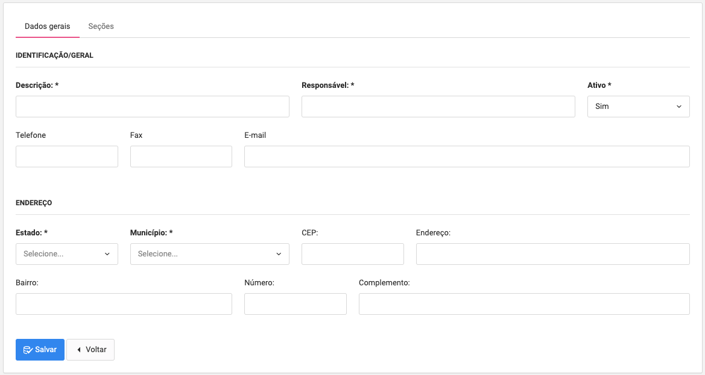

## Sobre o Projeto Curso Grupo Imatech.

Foi Desenvolvido um sistema com a seguinte perspectiva. Um sistema de gestão de Cursos com multiplas entidades Estudantis neste caso Chamadas de CDE --> (Centro de Distribuição Estudantil), aonde se realiza o cadastro de Cursos, que ficam a disposição de todos os polos (CDE), aonde cada polo adiciona o curso em seus registro determinando a data de início da turma, quantidade de vagas disponível e o período. Cada CDE também consegue realizar Cadastro dos alunos assim como a matrícula, efetivando o aluno em seu curso. segue as informações de disponíveis. 

## MENU

- [Dashboard]().
- [Sistema]().
- Sub-Menu [Sistema GERAL - Unidades]() 

        _- Cadastra de Unidades e Sessões como (Administrativas,Pedagógicas, Sessão Professoras e Etc,) 
        
          
        

- Sub-Menu [Sistema GERAL - Perfils]().

        _- Cadastro de Perfil relacioando com Unidade Gerada Anteriormente você consegue direcionar as permissões que serão dadas a este Perfil;

- Sub-Menu [Sistema GERAL - Usuários]().
        
        _- Cadastro de Usuários, Dados do Usuário serão registrados e a ele o Perfil-> que esta realacionado com a Unidade; 

- Sub-Menu [Sistema GERAL - Centro de Distribuição]().
        
        _- Finalmente Cadastro de CDE - Centro de Distribuição Estutantil - Que proverá toda Gestão do fluxo a seguir; 

- Sub-Menu [Sistema ENDEREÇAMENTO - Estado]().

        _- Cadastro dos Estados em Geral; 

- Sub-Menu [Sistema ENDEREÇAMENTO - Municípios]().
        
            _- Cadastro dos Municípios em Geral; 

- Sub-Menu [Sistema CONFIGURAÇÕES - Auditoria]().
            
            _- Auditoria o sistema possui uma estrutura de Auditoria que monitora toda atividade do usuário e registra a informação
             
- Sub-Menu [Sistema CONFIGURAÇÕES - Sistema]().

            _- Configurações Gerais - Como: Fuso horário,E-mail, e Termo de Uso;

- [Gestão Matrícula]().
            
- Sub-Menu [Cadastro de Matrículas]().
            
            _- Cadastro de Matrícula do aluno dentro do CDE;
           
- Sub-Menu [Listagem de Matrículas]().
           
           _- Listagem de Matrícula do aluno dentro do CDE;
           
- [Gestão Aluno]().
- Sub-Menu [Cadastro de Alunos]().
           
           _- Cadastro do aluno dentro do CDE;
           
- Sub-Menu [Listagem de Alunos]().
           
           _- Listagem do aluno dentro do CDE;
           
- [Gestão Cursos]().
- Sub-Menu [Cadastro de Período]().
           
           _- Cadastro de Período dos Cursos(Matutino,Vespertino,Noturno);
           
- Sub-Menu [Listagem de Período]().
           
           _- Listagem de Período dos Cursos;
           
- Sub-Menu [Cadastro de Cursos]().

           _- Cadastro dos Cursos de Acesso a Todos os CDEs;
           
- Sub-Menu [Listagem de Cursos]().
           
           _- Listagem dos Cursos de Acesso a Todos os CDEs;
           
           
- Sub-Menu [Listar Cursos Cadastro Educacional]().

           _- Cadastro dos Cursos Dentro dos CDE, com toda particularidade como, quantidade de vagas disponíveis,data de início da turma e período;

na Barra Superior do Menu se encontra o menu de Gestão do Usuário, lado Esquerdo do ícone de usuário se encontrado a Unidade Lotada do Usuário atual, do lado direito o Nome do Perfil e Primeiro nome do usuário, clicando em cima do nome do usuário voce encontra 3 menus:

- Sub-Menu [Alterar Senha]().
           
           _- Trocar a senha do usuário;
           
- Sub-Menu [Selecionar Centro]().
           
           _- Um usuário pode ser lotado em mais de uma CDE, sendo assim você pode navegar entre os Centros aqui;
           
- Sub-Menu [Alterar Perfil]().
           
           _- Alterar Perfil do Usuário;
           

## Cadastro de Usuários

O Cadastro de usuários novos o login e senha são o cpf do usuário, no hora do usuário se logar no sistema ele será redirecionado para uma nova view que solicitara uma nova senha do mesmo.

## Contributing

Thank you for considering contributing to the Laravel framework! The contribution guide can be found in the [Laravel documentation](https://laravel.com/docs/contributions).

## Code of Conduct

In order to ensure that the Laravel community is welcoming to all, please review and abide by the [Code of Conduct](https://laravel.com/docs/contributions#code-of-conduct).

## Security Vulnerabilities

If you discover a security vulnerability within Laravel, please send an e-mail to Taylor Otwell via [taylor@laravel.com](mailto:taylor@laravel.com). All security vulnerabilities will be promptly addressed.

## License

The Laravel framework is open-sourced software licensed under the [MIT license](https://opensource.org/licenses/MIT).
